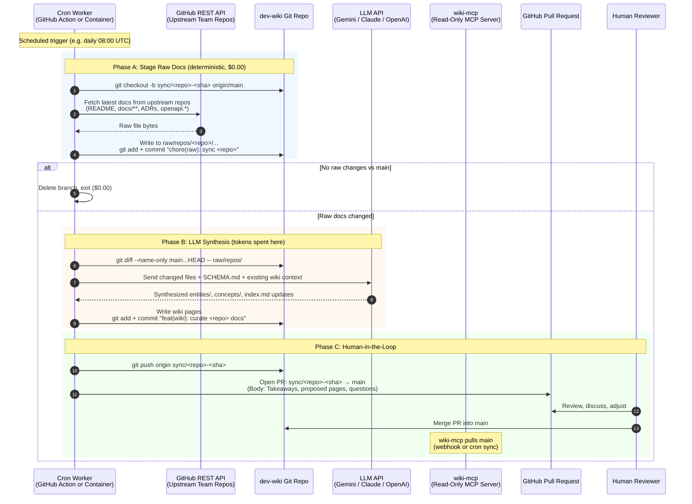

# Full Architecture & Implementation Plan: Cron-Based Repo Sync + LLM Ingestion Pipeline

## Status

| Phase | Description | Status |
| :--- | :--- | :--- |
| **Phase 1** | Remove `/webhook/repo-sync` from `wiki-mcp` | ✅ Done (`d4e8f47`, `cdf1c1a`) |
| **Phase 2** | `dev-wiki` conventions: SCHEMA.md + Git checkpoint | 🔜 Next |
| **Phase 3** | Orchestration service: cron + LLM + branch + PR | 📋 Planned |

---

## End-to-End Data Flow



---

## Phase 2: `dev-wiki` Conventions (Next Step)

> [!NOTE]
> This phase is small and self-contained. It touches 1 file in `dev-wiki` and creates 1 Git tag. No code, no dependencies, no API keys.

### Changes

#### [MODIFY] [SCHEMA.md](file:///Users/paolo/Projects/dev-wiki/SCHEMA.md)

After the existing `### raw/ Frontmatter` section (line 45), add:

```markdown
### raw/repos/ (Verbatim Repository Mirrors)

Documentation mirrored 1:1 from upstream team repositories lives under `raw/repos/<repo-name>/`:
- Files are exact copies of upstream `README.md`, `docs/**`, ADRs, and API contracts.
- **No frontmatter is injected.** Git commit history tracks when each file was synced and from which upstream commit.
- Change detection uses native `git diff` against `main`, not SHA-256 hashes.
- Synthesis into `entities/` and `concepts/` is performed via automated PR (see orchestration pipeline) or on-demand by a human curator.
```

#### Git Checkpoint Tag

```bash
cd /Users/paolo/Projects/dev-wiki
git tag wiki/last-ingest HEAD
```

This establishes the baseline. The orchestrator in Phase 3 can optionally use this tag as a fallback reference, though the branch-based approach (`git diff main...HEAD`) is the primary mechanism.

### Verification
- Confirm `SCHEMA.md` renders correctly in Obsidian / GitHub.
- Confirm `git rev-parse wiki/last-ingest` resolves to current HEAD.

---

## Phase 3: Orchestration Service (LLM + Branch + PR)

This is the main engineering effort. It introduces a new service that runs on a schedule, fetches upstream docs, calls the LLM, and opens Pull Requests.

### Open Decisions Requiring User Input

> [!IMPORTANT]
> **Decision 1: Where does the orchestrator live?**
>
> | Option | Pros | Cons |
> | :--- | :--- | :--- |
> | **A. GitHub Actions workflow in `dev-wiki`** | Zero infra, free for public repos, secrets managed by GitHub | Coupled to GitHub, 6-hour max job duration |
> | **B. Standalone Python service in `wiki-mcp`** | Reuses existing codebase and `git_sync.py` utilities, runs anywhere | Needs a server/container to host the cron |
> | **C. New standalone repo** | Clean separation of concerns | Yet another repo to maintain |

> [!IMPORTANT]
> **Decision 2: LLM Provider & SDK**
>
> | Option | Dependency | Token Cost Model |
> | :--- | :--- | :--- |
> | **A. Google Gemini (Native SDK `google-genai`)** | 1 pip package, ~100 LOC | Pay-per-token or free tier |
> | **B. Anthropic Claude (Native SDK `anthropic`)** | 1 pip package, ~100 LOC | Pay-per-token |
> | **C. LangGraph** | `langgraph` + `langchain-core` + provider SDK | Same token cost, heavier framework |
>
> **Ponytail recommendation:** Native SDK (A or B). LangGraph adds framework lock-in and version churn for what is fundamentally a linear pipeline (fetch → diff → synthesize → commit → PR). If we later need retry loops or branching agent logic, we can introduce LangGraph then.

> [!IMPORTANT]
> **Decision 3: Which upstream repos to track?**
>
> We need a configuration file or list specifying which GitHub repositories to monitor for documentation changes. This could be:
> - A simple `repos.yaml` or `repos.json` in `dev-wiki` or the orchestrator directory.
> - Environment variable `TRACKED_REPOS=org/billing-service,org/auth-service`.

---

### Required Secrets & Environment Variables

| Secret | Purpose | Where Stored |
| :--- | :--- | :--- |
| `GITHUB_TOKEN` | Clone/fetch upstream repos, push branches, open PRs via GitHub API | GitHub Actions secret or `.env` |
| `LLM_API_KEY` | API key for the chosen LLM provider (Gemini / Claude / OpenAI) | GitHub Actions secret or `.env` |
| `LLM_MODEL` | Model identifier (e.g. `gemini-2.5-pro`, `claude-sonnet-4-20250514`) | Config file or env var |

### Proposed File Structure

Assuming Option B (standalone service in `wiki-mcp`):

```
wiki-mcp/
├── src/wiki_mcp/
│   ├── ...existing MCP server code...
│   └── orchestrator/           # NEW: Cron ingestion pipeline
│       ├── __init__.py
│       ├── config.py           # Load tracked repos, LLM config, GitHub token
│       ├── repo_fetcher.py     # Fetch docs from upstream repos via GitHub API
│       ├── diff_checker.py     # git diff main...HEAD -- raw/repos/
│       ├── synthesizer.py      # LLM call: raw docs → wiki page drafts
│       ├── pr_opener.py        # Push branch + open GitHub PR via REST API
│       └── runner.py           # Main entry point: ties phases A→B→C together
├── repos.yaml                  # NEW: List of tracked upstream repositories
└── pyproject.toml              # Add orchestrator CLI entry point + LLM dependency
```

### `repos.yaml` Example

```yaml
# Upstream repositories to track for documentation changes
repos:
  - name: billing-service
    full_name: your-org/billing-service
    doc_paths:            # Optional: restrict to specific paths (default: README*, docs/**)
      - "README.md"
      - "docs/**"
  - name: auth-service
    full_name: your-org/auth-service
  - name: airbyte-infra
    full_name: your-org/airbyte-infra
    doc_paths:
      - "docs/**"
      - "*.md"
```

### Runner Logic (Pseudocode)

```python
# orchestrator/runner.py — ponytail: one clean script
def run_ingestion_cycle(wiki_dir, repos_config, llm_client, github_token):
    for repo in repos_config:
        # Phase A: Stage raw docs
        branch = f"sync/{repo.name}-{upstream_sha[:8]}"
        git_checkout_branch(wiki_dir, branch, from_ref="origin/main")
        changed_files = fetch_and_stage_docs(wiki_dir, repo, github_token)

        if not changed_files:
            git_delete_branch(wiki_dir, branch)
            continue

        git_commit(wiki_dir, f"chore(raw): sync {repo.name} docs from {upstream_sha[:8]}")

        # Phase B: LLM synthesis
        diff_files = git_diff_against_main(wiki_dir, "raw/repos/")
        raw_content = read_files(wiki_dir, diff_files)
        existing_context = read_schema_and_index(wiki_dir)

        wiki_updates = llm_client.synthesize(
            raw_docs=raw_content,
            schema=existing_context.schema,
            index=existing_context.index,
            existing_pages=search_related_pages(wiki_dir, repo.name),
        )

        write_wiki_pages(wiki_dir, wiki_updates)
        git_commit(wiki_dir, f"feat(wiki): curate {repo.name} documentation")

        # Phase C: Push + Open PR
        git_push(wiki_dir, branch)
        open_pull_request(
            github_token=github_token,
            repo="your-org/dev-wiki",
            head=branch,
            base="main",
            title=f"Wiki Ingestion: {repo.name} documentation update",
            body=format_pr_body(wiki_updates),
        )
```

### PR Body Template

The LLM-generated PR body follows a structured format so the human reviewer has full context:

```markdown
## 📥 Source: `billing-service` (upstream commit `a1b2c3d`)

### 💡 Key Takeaways
- [LLM-generated summary of what changed in the upstream docs]
- [Architectural highlights, new endpoints, deprecations]

### 📝 Wiki Pages Created / Updated
| Page | Action | Summary |
| :--- | :--- | :--- |
| `entities/billing-service.md` | Updated | Added new payment gateway integration section |
| `concepts/event-driven-billing.md` | Created | New pattern extracted from billing-service ADR-003 |
| `index.md` | Updated | Added `[[event-driven-billing]]` under Concepts |

### ⚠️ Questions for Reviewer
- [Any contradictions with existing wiki content]
- [Ambiguous claims that need human judgment]

### 📎 Raw Files Synced
- `raw/repos/billing-service/README.md`
- `raw/repos/billing-service/docs/architecture.md`
```

---

## Dependencies to Add (Phase 3)

```toml
# pyproject.toml additions
[project.optional-dependencies]
orchestrator = [
    "google-genai>=1.0.0",   # or "anthropic>=0.30.0" depending on Decision 2
    "pyyaml>=6.0",            # already present
    "httpx>=0.27.0",          # already present
]
```

New CLI entry point:
```toml
[project.scripts]
wiki-mcp = "wiki_mcp.cli:main"
wiki-ingest = "wiki_mcp.orchestrator.runner:main"   # NEW
```

---

## Verification Plan

### Phase 2 Verification
1. `SCHEMA.md` renders correctly with the new `raw/repos/` section.
2. `git rev-parse wiki/last-ingest` resolves cleanly.

### Phase 3 Verification
1. **Unit tests** for each orchestrator module (`repo_fetcher`, `diff_checker`, `synthesizer`, `pr_opener`).
2. **Dry-run mode** (`wiki-ingest --dry-run`): Runs the full pipeline but prints the PR body to stdout instead of pushing/opening.
3. **Integration test**: Run against a test fork of `dev-wiki` with a known upstream repo change, verify the PR is opened with correct content.
