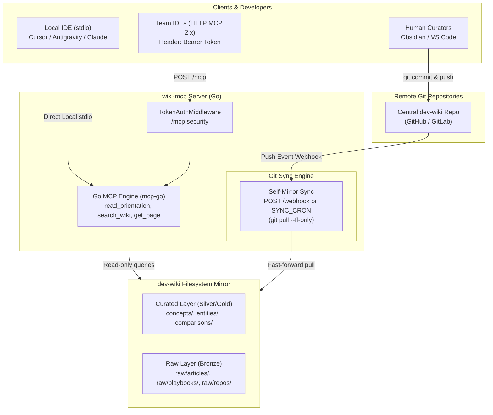

# wiki-mcp

A high-performance, read-only [Model Context Protocol (MCP)](https://modelcontextprotocol.io/) server written in **Go** for [Karpathy-style LLM Markdown wikis](https://gist.github.com/karpathy/442a6bf555914893e9891c11519de94f).

Packaged as a single static binary (~8.7MB) with zero external runtime dependencies, ultra-fast startup (<10ms), and minimal memory usage (~10MB RAM).

Supports both **Local Mode** (`stdio`) and **Remote Mode** (**Streamable HTTP**, MCP 2.x standard) backed by a Git repository with automatic webhook and cron synchronization.

---

## The 3 Read-Only Tools

1. **`read_orientation()`**: Reads `SCHEMA.md`, `index.md`, and the last 30 lines of `log.md` in a single roundtrip for instant agent orientation.
2. **`search_wiki(query, tag="")`**: Fast full-text and taxonomy-tag search across curated wiki directories (`concepts/`, `entities/`, `comparisons/`, `queries/`).
3. **`get_page(slug_or_path)`**: Safely reads any wiki page, cleanly parsing frontmatter YAML and markdown body. Accepts direct paths (`concepts/auth.md`) or simple slugs (`auth`).

Zero file mutation or deletion tools are exposed, guaranteeing your wiki's integrity.

---

## Build & Install

Requires Go 1.23+:

```bash
# Build static binary to bin/wiki-mcp
make build

# Or install to $GOPATH/bin
go install ./cmd/wiki-mcp
```

---

## Running in Local Mode (stdio)

Run directly against your local wiki:

```bash
./bin/wiki-mcp stdio --wiki-dir /path/to/wiki
```

### Local Client Config (`mcp_config.json`):
```json
{
  "mcpServers": {
    "dev-wiki": {
      "command": "/Users/paolo/Projects/wiki-mcp/bin/wiki-mcp",
      "args": [
        "stdio",
        "--wiki-dir",
        "/path/to/wiki"
      ]
    }
  }
}
```

---

## Running in Remote Mode (Streamable HTTP)

In Remote Mode, `wiki-mcp` runs as a centralized daemon on a server or container. It optionally clones/pulls the wiki Git repo on startup and listens for incoming IDE connections and GitHub/GitLab webhooks.

### CLI Launch
```bash
./bin/wiki-mcp serve \
  --host 0.0.0.0 \
  --port 8080 \
  --wiki-dir /data/wiki \
  --repo-url "https://github.com/your-org/dev-wiki.git" \
  --auth-token "team-secret-token" \
  --webhook-secret "webhook-hmac-secret" \
  --sync-cron "*/5 * * * *"
```

### Environment Variables
| Variable | Description | Default |
| :--- | :--- | :--- |
| `HOST` | Bind address | `0.0.0.0` |
| `PORT` | HTTP port | `8080` |
| `WIKI_DIR` | Local filesystem path to cache/clone wiki | Current directory (`.`) |
| `REPO_URL` | Git remote URL to clone if path is empty | `""` |
| `AUTH_TOKEN` | Bearer token required for `/mcp` endpoints | `""` (open) |
| `WEBHOOK_SECRET` | Secret for verifying wiki repository webhooks | `""` (open) |
| `SYNC_CRON` | Standard 5-field cron expression for periodic git pull (e.g. `*/5 * * * *`) | `""` (webhook-only) |

---

### Remote Git Sync Modes
`wiki-mcp` remote mode supports three operational synchronization models:
1. **Webhook-only (Default):** Set `WEBHOOK_SECRET`. When commits are pushed to the wiki repository, GitHub/GitLab hits `POST /webhook` to trigger an immediate `git pull --ff-only`.
2. **Cron-only (Zero-Ingress / Private Networks):** Set `SYNC_CRON="*/5 * * * *"`. The server periodically runs `git pull --ff-only` in the background. Ideal for air-gapped or private networks/VPCs where opening inbound webhook ingress is not possible or desired.
3. **Hybrid (GitOps Best Practice):** Configure both `WEBHOOK_SECRET` and `SYNC_CRON`. Pushes trigger instant zero-latency sync via webhook, while the cron scheduler acts as a background reconciliation loop ensuring eventual consistency. An internal mutex guarantees that webhook and cron pulls never collide.

---

### Clarification: Webhook for Wiki Repo vs. Cron for Source Repos

| Responsibility | Mechanism | Target Repository | Description |
| :--- | :--- | :--- | :--- |
| **Wiki Read Cache Mirror** | `POST /webhook` and/or `SYNC_CRON` | **Only the wiki repo** (`dev-wiki`) | Keeps `wiki-mcp`'s local read cache synchronized with `dev-wiki` on GitHub. When a curator or PR updates `entities/` or `concepts/`, `wiki-mcp` pulls immediately. |
| **External Source Docs Ingestion** | **Scheduled Cron Orchestrator** | **Team repos** (`raw/repos/`) | External team repos do **NOT** send webhooks to `wiki-mcp`. A scheduled cron pipeline stages their documentation into `dev-wiki/raw/repos/`, checks diffs via native Git, and opens a **Pull Request** for human review. |

---

## Remote Endpoints

* **`POST /mcp`**: The core MCP Streamable HTTP endpoint. If `AUTH_TOKEN` is configured, requests must supply `Authorization: Bearer <AUTH_TOKEN>`.
* **`GET /health`**: Public liveness and readiness probe for load balancers. Returns health and detailed sync state:
  ```json
  {
    "status": "healthy",
    "wiki": "/data/wiki",
    "commit": "050420c",
    "sync": {
      "mode": "hybrid",
      "cron_expression": "*/5 * * * *",
      "cron_enabled": true,
      "last_sync_at": "2026-09-08T22:05:00Z",
      "last_sync_trigger": "cron",
      "last_sync_status": "success",
      "last_sync_commit": "050420c",
      "last_sync_error": ""
    }
  }
  ```
* **`POST /webhook`**: Inbound webhook for the wiki's own repo (GitHub `X-Hub-Signature-256` / GitLab `X-Gitlab-Token`). Automatically triggers `git pull --ff-only` on the local mirror.

---

## Docker Deployment

### Docker Compose
```bash
docker compose up -d
```

### Docker Run
```bash
docker run -d \
  -p 8080:8080 \
  -v wiki-data:/data/wiki \
  -e REPO_URL="https://github.com/your-org/dev-wiki.git" \
  -e AUTH_TOKEN="team-secret-token" \
  -e WEBHOOK_SECRET="webhook-hmac-secret" \
  wiki-mcp:latest
```

---

## Developer Client Setup (Remote)

Developers on your team point their IDE (Antigravity IDE, Cursor, Claude Desktop) to your centralized instance:

```json
{
  "mcpServers": {
    "team-wiki": {
      "url": "https://wiki.internal.company.com/mcp",
      "headers": {
        "Authorization": "Bearer team-secret-token"
      }
    }
  }
}
```

---

## Architecture Overview



---

## Principles & Architecture

* **Single Static Binary:** Zero Python runtime, pip, or venv overhead. Statically compiled Go binary (~8.7MB).
* **12-Factor XI (Logs):** Treats logs as unbuffered event streams to `stdout`.
* **12-Factor III (Config):** Configuration driven strictly by environment variables or CLI flags.
* **Gall's Law & YAGNI:** Starts from a simple, reliable core (shallow Git clone + native MCP + webhook) without unnecessary database or caching bloat.
* **Wiki Principles (Ward Cunningham):** Convergence over locking, soft security via read-only access, and transparent observability via Git commit history and `log.md`.
